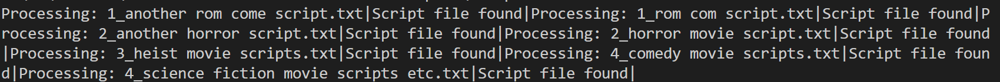
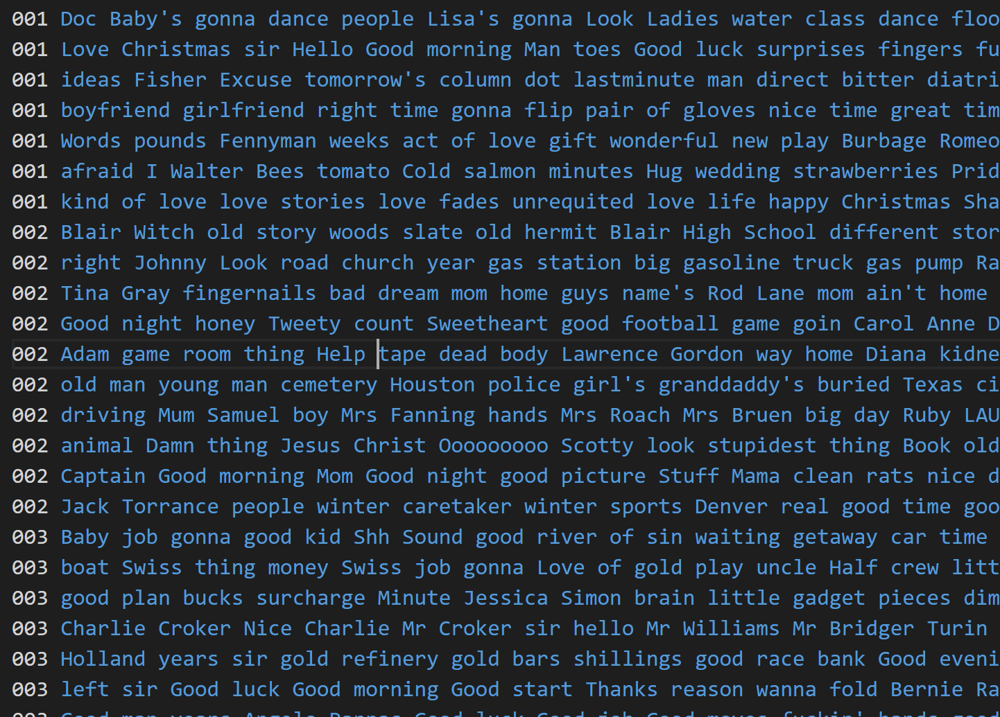
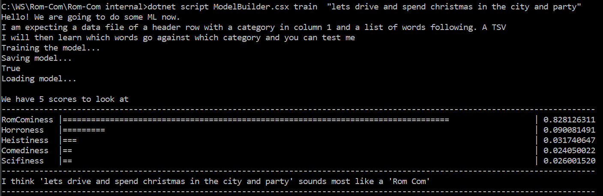
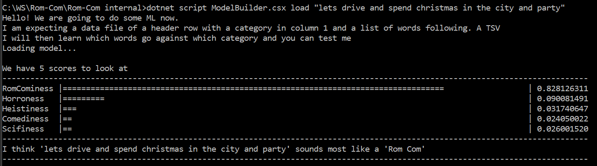
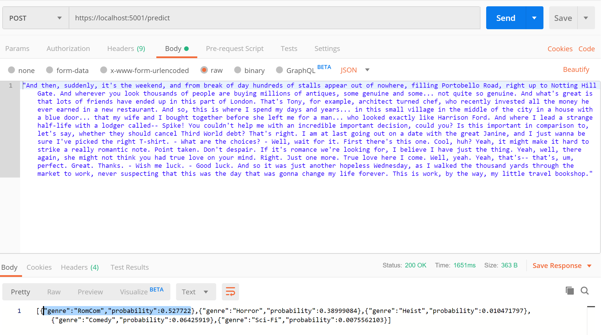
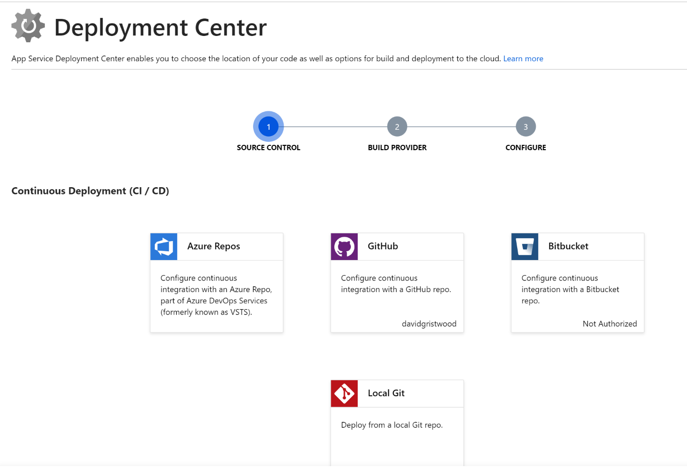
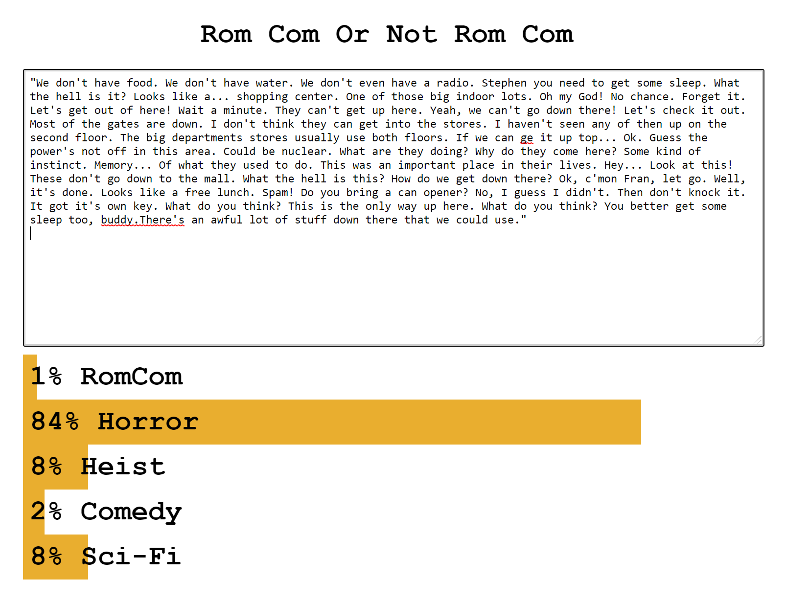

# rom-com-or-not-rom-com

"Rom-com or not rom-com" is an ML.NET project designed to run a machine learning model over a text document and determine if it exhibits the classic characteristics of a rom-com film script (or a horror, heist, comedy or science fiction film).

It was inspired by [Mark Kermode's Secrets of Cinema](https://www.bbc.co.uk/programmes/b0bbn5pt) excellent series on the BBC, which examines classic film genres, such as rom-coms, comedies, etc, and explores the structures, formats, film techniques and plot points that are common to each of these genres.

In the project we take an alternative AI approach to this same concept, and do a textual analysis on a whole load of movie scripts, by genre, and then use a  machine learning algorithm to codify this, so that we can then take any arbitrary piece of text and rate it for the likelihood of it being in one of these genres. So, with a big Hello to Jason Isaacs, let's see how it works....

# Getting Going

This project is easy to get up and going, and at its core, boils down to a three stage process:

- Run the Script Builder to churn through lots of film scripts and use Azure Text Analytics to build up a "database" of key words and phrases for each film script
- Use Model Builder to create, train and save an ML.NET machine learning model (and do a quick prediction check at the same time) 
- Use the PredictAPI .net core web app to post a body of text for analysis using the saved machine learning model

You can then of course then wrap the API behind any application you want.
This project, as of Novemeber has been updated to .net core 3.x, so please make sure you have the relevant SDKS etc installed. 

# Script Builder 

Script Builder uses Azure Text Analytics to detect sentiment, key phrases, named entities and language from a body of text. We use this service to analyse and process a whole load of movie scripts, each off which we have to label up front by genre.

We can't legally share or distribute film scripts, but there are many websites on-line that contain copies of most  popular film scripts for research etc. Simply put each film script in the .\scripts folder and ensure each file starts with a single digit to denote genere and an underscore:

- 1_rom com.txt
- 2_horror.txt
- 3_heist.txt
- 4_comedy.txt
- 5_science fiction.txt

There are some dummy text placeholders in this directory to start you off - simply delete them and replace them with the real film scripts.

At the command line, run this command

    dotnet script .\ScriptProcessor.csx 

Depending on the scripts you have sourced, you should see something  like this:

The output from this process is a tab separated file, data.tsv, that contains the data for the machine learning model. It has one line per analysed film, and two columns:

- Label: 001 for rom-com, 002 for horror, etc
- Key Phrases: The de-duped text from the Azure Text Analytics

Here is an example of the data file, showing some of the key words the text analytics process extracted:

# Model Builder

Having created the data.tsv file, the next stage is to build a machine learning model. We use a multi-class classification model, which will give us a probability from the model for each genres. This is essentially like running a binary classifier for each of the genre. 

If you haven't worked with this type of model, the [Sentiment analysis](https://github.com/dotnet/machinelearning-samples/tree/master/samples/csharp/getting-started/BinaryClassification_SentimentAnalysis) sample is a classic example of a binary classifier, which predicts if a piece of text has a positive or negative sentiment, based on supervised learning data set that has already been classified. The tutorial [Categorize support issues using multiclass classification with](https://docs.microsoft.com/en-us/dotnet/machine-learning/tutorials/github-issue-classification) takes you through the steps to create a multi-class classification model in more detail.

To use the model builder, at the command line run this command

	dotnet script ModelBuilder.csx  [train | load]  'some words to test'

The fist time you run this command, or when the data.tsv file has been updated, you need to run the command with the "train" option, so it builds and saves the model. As this can take several minutes depending on the szie of the data, subsequent runs can use the "load" option to load the  previously saved model.

Train:

Load:

Notice how Model Builder also does a predictive test on a phrase you can pass in on the command line, as a quick test to validate the model with a probability rating for each genre. As you can see from the above screen shots, there is a very high probabilty that this is rom-com, with a small chance it might be a horror.

# Predict Web API

The final step is a .NET Core webapi application that can be used to take HTTP Posts and run the machine learning model on the body of ther request, allowing us test a more substantive szied chunk of text.

The applciation is a simple MVC application with a Predict controller which has a single POST method. It returns a JSON string with the probability data for each genre.

You can test the application with programs like Postman:

# Deployment 

The final stage is to deploy the Web API with the model to Azure. There are a variety of DevOps ways to do this, but one of the simplest is to use an Azure AppService, and to use its Deployment Centre to do all the heavy lifting.

# and finally...

Once deployed, use the front end script project, which is a simple Javascrip web interface, to enter some text, and call the API, such as this from "Dawn of the Dead":

We have provided a couple of test script extracts, which are not in the training data, in the "test extracts" folder
